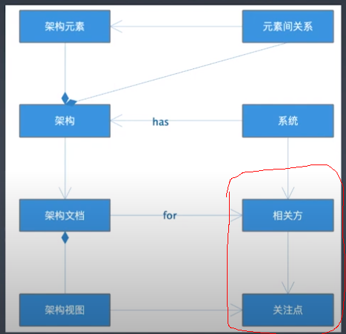
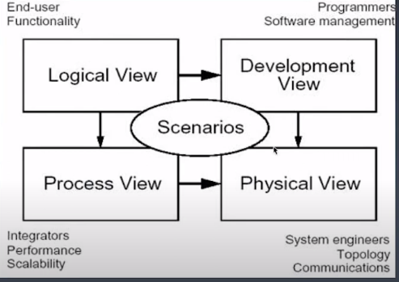
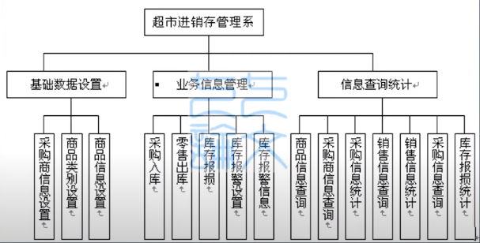
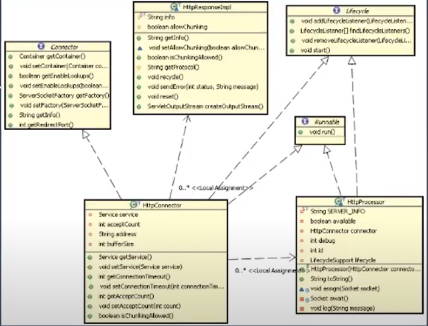
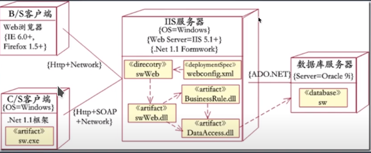
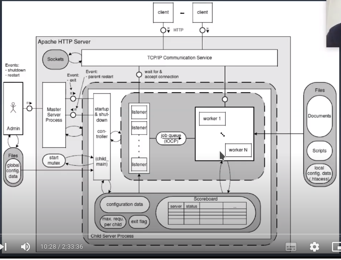
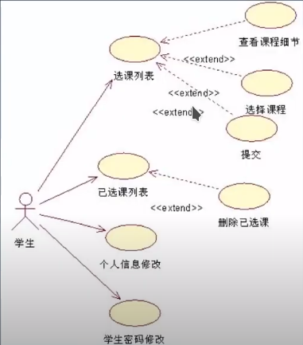

# 架构方法：架构师如何做架构

## 综述

- 架构应该怎么学
  - 关注解决问题的逻辑，而不是用什么技术
  - 学技术也是在学这这项技术解决了什么问题，怎么解决的
- 什么是软件架构

  

  - 软件架构的核心是理解不同相关方的需求和关注点
  - 设计架构去满足各方的需求
  - 用文档和架构图展示架构设计
  - 文档要针对不同相关方的关注点特别设计

## 如何画架构视图

- 关键要想画了是给谁看的，是不是能看的懂
- 4+1 视图模型 (重点是理念非常好，考虑了多个方面)

  

  - 逻辑视图

    

    - 相关方： 客户，用户，开发组织管理者
    - 视角：系统的功能元素，以及他们接口，职责，交互
    - 主要元素：系统，子系统，功能模块，接口
    - 用途：开发组织划分，成本/进度的评估
  - 开发视图

    

    - 相关者：相关开发人员，测试人员
    - 视角：系统如何开发实现
    - 主要元素：描述系统的层，分区，包，框架，系统通用服务，业务通用服务，类和接口，系统平台和相关系统框架
    - 用途：指导开发组织设计和开发实现
  - 物理视图

    

    - 相关者：系统集成商，系统运维人员
    - 视角：系统逻辑组件到物理节点的物理部署和节点之间的物理网络配置
    - 主要元素：物理节点以及节点的通信
  - 过程视图
    
    
    
    - 相关者：性能优化，开发相关人员
    - 视角：系统运行时线程，进程的情况
    - 主要元素：系统进程，线程以及处理队列等

  - 场景视图

    

    - 相关者：用户，设计和开发人员
    - 视角： 概括了架构上最重要的场景（最典型或者最有风险）以及非功能性要求，通过这些场景的实现，阐明了架构的广度或众多架构元素的方式
- 软件建模语言
  - 如何使用 UML 进行软件架构设计与建模?
    - 关键的是用它表达什么设计意图，给什么人看
    - 总公 10 种模型，常用的 7 种
  - 什么是模型
    - 是一个抽象
    - 从领域问题（对特定问题的求解）映射到计算机系统问题

      
  - 为什么要建模
    - 沟通 !!!
    - 保存最终的成果
- UML (Unified Modeling Language)